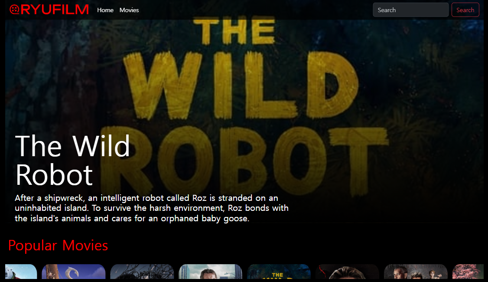
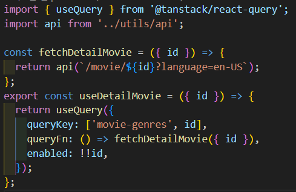
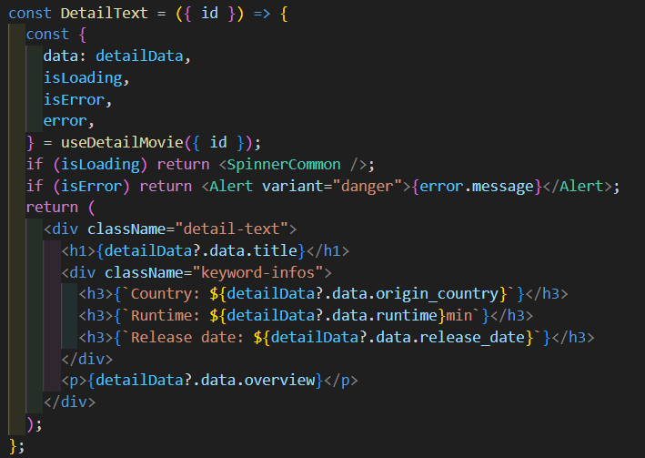
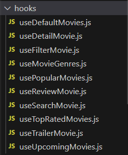

# 영화 웹 사이트 RYUFILM

## 💻프로젝트 소개

NETLIX를 참고해서 만든 영화 정보 제공 사이트입니다.

## 특징

### React Query를 사용해서 서버데이터를 관리

<!-- 

  
  

 -->
<table style="width: 100%; border-collapse: collapse;">
  <tr>
    <td style="width: 40%; padding: 0; margin: 0;">
      
    </td>
    <td style="width: 60%; padding: 0; margin: 0;">
      
    </td>
  </tr>
</table>

<!-- | {:width:"30%"} | {:width:"50%"} |
| ------------------------------------------------------ | ------------------------------------------------------- | -->

### 각 페이지마다 비즈니스 로직과 UI를 분리하여 컴포넌트 구성

- 데이터 불러오는 부분을 custom hook으로 생성
  
