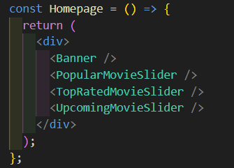
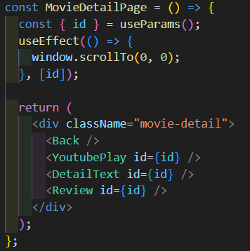

# 영화 웹 사이트 RYUFILM

[배포 주소](https://ryufilm.netlify.app/)

## 💻프로젝트 소개

NETFLIX를 참고해서 만든 영화 정보 제공 사이트입니다.

## 📌구성과 기능

3개의 페이지

- 홈페이지(HomePage)
- 전체 영화 페이지(MoviesPage)
- 영화 상세정보 페이지(MovieDetailPage)

### 홈페이지

- 3개 카테고리의 슬라이더(Popular, Top Rated, Upcoming)
  

### 전체 영화 페이지

---

- 장르 선택
- 정렬선택
- 키워드로 검색
- 페이지네이션
  
  

### 영화 상세정보 페이지

---

- 무비 카드 모달창의 Start 버튼 누르면 영화 상세정보 페이지로 이동
- 예고편 유튜브 영상
- 상세 정보
- 후기 댓글
  
  <!--  -->

## 💡특징

### **React Query**를 사용해서 서버상태 관리

|  |  |
| ---------------------------------------- | ----------------------------------------- |

### 각 페이지마다 최대한 비즈니스 로직과 UI를 분리하여 컴포넌트 구성

|  |  |
| ------------------------------------------- | ----------------------------------------------------- |

- 데이터 불러오는 부분을 custom hook으로 생성
  

## 반응형

- 태블릿
  
- 모바일
  
